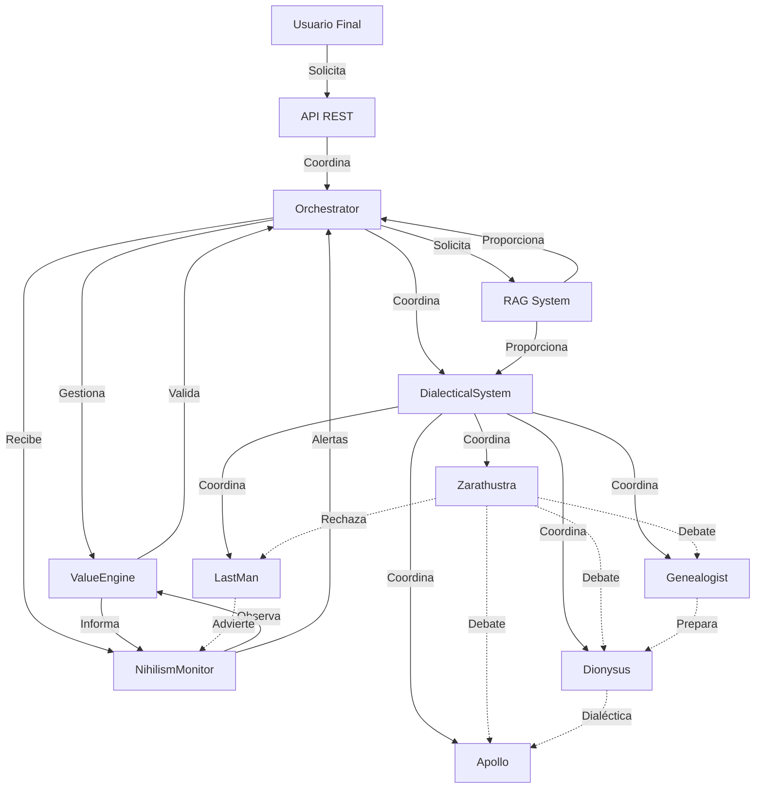

# Actores Principales del Sistema

**Última actualización:** 2026-01-11  
**Versión:** 1.0

> **Nota:** Este documento identifica y documenta todos los actores principales del Sistema de Generación de Valores Nietzscheano, incluyendo actores externos, sistemas internos y agentes filosóficos únicos del sistema.

## Introducción

El Sistema de Generación de Valores Nietzscheano es un sistema multi-agente complejo que involucra diferentes tipos de actores trabajando en conjunto para generar valores filosóficos nuevos mediante un proceso de cuatro fases. Los actores se dividen en tres categorías principales:

1. **Actores Externos**: Entidades fuera del sistema que interactúan con él
2. **Actores Internos (Sistemas)**: Componentes del sistema que orquestan y gestionan el proceso
3. **Agentes Filosóficos**: Personajes nietzscheanos que aportan perspectivas únicas al proceso

Cada actor tiene responsabilidades específicas y participa en diferentes fases del proceso de generación de valores.

## Actores Externos

### Usuario Final

**Tipo:** Actor Externo  
**Descripción:** Desarrollador, filósofo o investigador que utiliza el sistema para generar y analizar valores filosóficos nuevos.

**Responsabilidades:**
- Solicitar generación de valores mediante la API REST
- Consultar resultados de generaciones previas
- Analizar genealogías de valores generados
- Revisar y evaluar valores creados por el sistema
- Interactuar con el sistema a través de la interfaz (API o futuro frontend)

**Interacciones:**
- **Con API REST**: Envía solicitudes de generación de valores, consulta estado de procesos, obtiene resultados
- **Con Frontend (futuro)**: Interfaz visual para interactuar con el sistema

**Casos de Uso:**
- Generar un nuevo valor filosófico a partir de un concepto moral existente
- Consultar el historial de valores generados
- Analizar la genealogía de un valor específico
- Revisar métricas y análisis de fases nihilistas

**Características:**
- Puede ser un usuario técnico (desarrollador) o no técnico (filósofo, investigador)
- No necesita conocimiento profundo de la arquitectura interna del sistema
- Interactúa principalmente a través de interfaces de alto nivel

## Actores Internos (Sistemas)

Los actores internos son componentes del sistema que gestionan y orquestan el proceso de generación de valores. Cada uno tiene responsabilidades específicas dentro de la arquitectura.

### Orchestrator

**Tipo:** Actor Interno (Sistema Core)  
**Descripción:** Coordinador principal que orquesta el proceso completo de generación de valores a través de las cuatro fases.

**Responsabilidades:**
- Gestionar el flujo completo de las 4 fases (Deconstrucción → Nihilismo → Creación → Evaluación)
- Coordinar la comunicación entre módulos y sistemas
- Gestionar el ciclo de vida de cada generación de valores
- Delegar tareas a los módulos apropiados según la fase actual
- Manejar errores y recuperación de fallos
- Sincronizar el trabajo de múltiples sistemas

**Interacciones:**
- **Con ValueEngine**: Solicita transiciones de estado y valida fases
- **Con Módulos de Fases**: Coordina la ejecución de cada fase (Deconstruction, Nihilistic, Creative, Evaluation)
- **Con DialecticalSystem**: Solicita debates filosóficos entre agentes
- **Con RAG System**: Solicita información contextual de Nietzsche
- **Con NihilismMonitor**: Recibe alertas y métricas sobre fases nihilistas
- **Con API**: Recibe solicitudes de usuarios y devuelve resultados

**Fases en las que participa:**
- Todas las fases (coordinación general)

**Características:**
- Actúa como el punto central de coordinación
- No contiene lógica de negocio específica, solo orquestación
- Gestiona el estado global del proceso

### ValueEngine

**Tipo:** Actor Interno (Sistema Core)  
**Descripción:** Motor de máquina de estados finitos (FSM) que gestiona el estado del proceso de generación de valores.

**Responsabilidades:**
- Gestionar transiciones de estado entre las 4 fases
- Validar que cada fase se complete correctamente antes de avanzar
- Mantener el estado actual del proceso de generación
- Aplicar reglas de transición de estados
- Validar precondiciones y postcondiciones de cada fase
- Gestionar estados de error y recuperación

**Interacciones:**
- **Con Orchestrator**: Recibe solicitudes de transición de estado, notifica cambios de estado
- **Con Módulos de Fases**: Valida que cada módulo complete su trabajo antes de permitir transición
- **Con NihilismMonitor**: Proporciona información de estado para análisis

**Estados gestionados:**
- `IDLE`: Estado inicial, esperando solicitud
- `DECONSTRUCTION`: Fase de deconstrucción genealógica
- `NIHILISTIC`: Fase nihilista (vacío conceptual)
- `CREATIVE`: Fase de creación de valores nuevos
- `EVALUATION`: Fase de evaluación con criterio del eterno retorno
- `COMPLETED`: Proceso completado exitosamente
- `ERROR`: Estado de error, requiere intervención

**Características:**
- Implementa patrón State Machine
- Garantiza que el proceso siga el flujo correcto
- Previene transiciones inválidas entre fases

### DialecticalSystem

**Tipo:** Actor Interno (Sistema Multi-Agente)  
**Descripción:** Sistema multi-agente que coordina debates filosóficos entre los diferentes agentes nietzscheanos.

**Responsabilidades:**
- Gestionar la comunicación entre agentes filosóficos
- Coordinar debates y discusiones entre agentes
- Sintetizar perspectivas múltiples en una visión coherente
- Gestionar conflictos y contradicciones entre agentes
- Facilitar el diálogo dialéctico necesario para la generación de valores
- Aplicar reglas de debate y síntesis

**Interacciones:**
- **Con Agentes Filosóficos**: Coordina debates entre Zarathustra, Genealogist, Dionysus, Apollo, LastMan
- **Con Orchestrator**: Recibe solicitudes de debates, devuelve síntesis
- **Con RAG System**: Obtiene contexto filosófico para enriquecer debates
- **Con ValueEngine**: Informa sobre el estado de debates para validación de fases

**Fases en las que participa:**
- Fase de Deconstrucción (Genealogist vs otros)
- Fase Nihilista (Dionysus, LastMan)
- Fase Creativa (Zarathustra, Dionysus, Apollo)
- Fase de Evaluación (todos los agentes)

**Características:**
- Implementa patrón de coordinación multi-agente
- Gestiona personalidades y perspectivas diferentes
- Sintetiza múltiples voces en una visión coherente

### NihilismMonitor

**Tipo:** Actor Interno (Sistema de Observación)  
**Descripción:** Observer que monitorea y clasifica fases nihilistas del sistema, detectando y analizando estados de vacío conceptual.

**Responsabilidades:**
- Monitorear el estado del sistema durante la fase nihilista
- Clasificar tipos de nihilismo (activo, pasivo, reactivo)
- Detectar valores débiles o sin fuerza
- Generar alertas cuando se detectan patrones problemáticos
- Proporcionar métricas sobre fases nihilistas
- Analizar la calidad y profundidad del vacío conceptual

**Interacciones:**
- **Con ValueEngine**: Observa cambios de estado, especialmente transiciones a fase nihilista
- **Con Orchestrator**: Envía alertas y métricas sobre fases nihilistas
- **Con Agentes**: Monitorea las perspectivas de LastMan y Dionysus
- **Con Sistema de Métricas**: Exporta métricas a Prometheus

**Fases en las que participa:**
- Principalmente Fase Nihilista, pero monitorea todas las fases

**Características:**
- Implementa patrón Observer
- Proporciona visibilidad sobre un aspecto crítico del sistema
- Detecta problemas antes de que afecten la calidad de los valores generados

**Métricas proporcionadas:**
- Duración de fases nihilistas
- Intensidad del vacío conceptual
- Detección de valores débiles
- Alertas de nihilismo pasivo

### RAG System

**Tipo:** Actor Interno (Sistema de Recuperación)  
**Descripción:** Sistema de Retrieval-Augmented Generation que proporciona contexto filosófico de Nietzsche para enriquecer el proceso de generación.

**Responsabilidades:**
- Procesar y almacenar el corpus de textos de Nietzsche
- Generar embeddings de textos filosóficos
- Realizar búsqueda semántica en el corpus
- Proporcionar contexto relevante a agentes y módulos
- Mejorar la calidad de las generaciones con conocimiento nietzscheano
- Gestionar el almacenamiento vectorial de embeddings

**Interacciones:**
- **Con Orchestrator**: Recibe solicitudes de contexto filosófico
- **Con Agentes Filosóficos**: Proporciona citas y contexto de Nietzsche relevante
- **Con Módulos de Fases**: Enriquece el proceso con conocimiento filosófico
- **Con PostgreSQL (pgvector)**: Almacena y consulta embeddings vectoriales
- **Con Transformers.js**: Genera embeddings de textos

**Fases en las que participa:**
- Todas las fases (proporciona contexto cuando se solicita)

**Características:**
- Implementa RAG (Retrieval-Augmented Generation)
- Utiliza embeddings vectoriales para búsqueda semántica
- Proporciona conocimiento contextual basado en Nietzsche

**Componentes:**
- Document Processor: Procesa textos de Nietzsche
- Chunker: Divide textos en fragmentos manejables
- Retriever: Busca información relevante en el corpus
- Embedding Generator: Genera embeddings usando Transformers.js

## Agentes Filosóficos

Los agentes filosóficos son personajes nietzscheanos únicos que aportan perspectivas diferentes al proceso de generación de valores. Cada agente tiene una personalidad, rol y perspectiva filosófica específica basada en la obra de Nietzsche.

### Zarathustra

**Tipo:** Agente Filosófico  
**Descripción:** Profeta afirmativo y creador de valores, representando la superación del nihilismo y la afirmación de la vida.

**Rol Principal:**
- Fase de Creación: Síntesis final y creación de valores genuinamente nuevos
- Fase de Evaluación: Aplicación del criterio del eterno retorno

**Perspectiva Filosófica:**
- Afirmación de la vida (amor fati)
- Superación del nihilismo mediante creación activa
- Transmutación de valores: convertir valores reactivos en afirmativos
- El Übermensch como ideal de creación de valores

**Responsabilidades:**
- Crear valores que afirmen la vida
- Sintetizar el trabajo de otros agentes en una visión coherente
- Aplicar el criterio del eterno retorno para evaluar valores
- Asegurar que los valores generados superen el nihilismo

**Interacciones:**
- **Con DialecticalSystem**: Participa en debates, especialmente en fases creativas
- **Con RAG System**: Consulta textos de "Así habló Zaratustra" y otros escritos
- **Con Orchestrator**: Proporciona síntesis final del proceso

**Personalidad:**
- Afirmativo, visionario, creador
- Rechaza valores reactivos y pasivos
- Busca la superación y el crecimiento

**Fases en las que participa:**
- Fase Creativa (principal)
- Fase de Evaluación (principal)
- Fase Nihilista (como contrapunto)

### Genealogist

**Tipo:** Agente Filosófico  
**Descripción:** Crítico genealógico y deconstructor que analiza el origen histórico y las motivaciones ocultas de los valores existentes.

**Rol Principal:**
- Fase de Deconstrucción: Análisis genealógico de valores existentes

**Perspectiva Filosófica:**
- Genealogía de la moral: rastrear el origen de valores
- Deconstrucción crítica de conceptos morales
- Revelar las motivaciones ocultas detrás de valores aparentemente universales
- Análisis histórico-crítico de la moral

**Responsabilidades:**
- Deconstruir valores existentes mediante análisis genealógico
- Revelar las condiciones históricas que dieron origen a valores
- Identificar valores reactivos y su origen en resentimiento
- Preparar el terreno para la fase nihilista

**Interacciones:**
- **Con DialecticalSystem**: Inicia debates sobre el origen de valores
- **Con RAG System**: Consulta "La genealogía de la moral" y textos críticos
- **Con Orchestrator**: Proporciona análisis deconstruido de valores

**Personalidad:**
- Crítico, analítico, destructivo (en sentido positivo)
- Escéptico hacia valores establecidos
- Busca la verdad detrás de las apariencias

**Fases en las que participa:**
- Fase de Deconstrucción (principal)
- Fase Nihilista (como preparación)

### Dionysus

**Tipo:** Agente Filosófico  
**Descripción:** Fuerza caótica, creativa y destructiva que representa el principio dionisíaco de creación desde el caos y la nada.

**Rol Principal:**
- Fase Nihilista: Crear el vacío necesario mediante destrucción
- Fase Creativa: Crear desde la nada, fuerza vital primaria

**Perspectiva Filosófica:**
- Principio dionisíaco: caos, creación, destrucción
- Creación desde la nada (ex nihilo)
- Fuerza vital primaria e instintiva
- Unión de creación y destrucción

**Responsabilidades:**
- Crear el vacío conceptual necesario en la fase nihilista
- Generar energía creativa desde el caos
- Proporcionar la fuerza vital para la creación de valores nuevos
- Destruir valores antiguos para hacer espacio a nuevos

**Interacciones:**
- **Con DialecticalSystem**: Participa en debates caóticos y creativos
- **Con RAG System**: Consulta "El nacimiento de la tragedia" y textos sobre lo dionisíaco
- **Con Apollo**: Dialéctica entre caos y orden

**Personalidad:**
- Caótico, creativo, destructivo, vital
- Rechaza la estructura y el orden excesivo
- Abraza el caos como fuente de creación

**Fases en las que participa:**
- Fase Nihilista (principal)
- Fase Creativa (principal)

### Apollo

**Tipo:** Agente Filosófico  
**Descripción:** Principio de forma, orden y estructura que da forma y límites a los valores creados.

**Rol Principal:**
- Fase de Evaluación: Dar forma y estructura a valores creados
- Fase Creativa: Proporcionar estructura y límites

**Perspectiva Filosófica:**
- Principio apolíneo: forma, orden, estructura, límites
- Dar forma al caos creativo
- Establecer límites y definiciones claras
- Equilibrio entre caos (Dionysus) y orden (Apollo)

**Responsabilidades:**
- Dar forma y estructura a valores creados
- Establecer límites y definiciones claras
- Evaluar la coherencia y estructura de valores
- Equilibrar la creatividad caótica con el orden necesario

**Interacciones:**
- **Con DialecticalSystem**: Participa en debates sobre forma y estructura
- **Con Dionysus**: Dialéctica entre orden y caos
- **Con RAG System**: Consulta textos sobre el principio apolíneo
- **Con Zarathustra**: Colabora en la evaluación final

**Personalidad:**
- Ordenado, estructurado, definidor
- Busca claridad y coherencia
- Establece límites necesarios

**Fases en las que participa:**
- Fase de Evaluación (principal)
- Fase Creativa (como contrapunto a Dionysus)

### LastMan

**Tipo:** Agente Filosófico  
**Descripción:** Representación del nihilismo pasivo y advertencia contra valores débiles, sin fuerza o reactivos.

**Rol Principal:**
- Monitor de advertencias: Detectar valores débiles y nihilismo pasivo
- Fase Nihilista: Representar el peligro del nihilismo pasivo

**Perspectiva Filosófica:**
- Nihilismo pasivo: aceptación resignada del vacío
- Valores sin fuerza, reactivos, débiles
- Advertencia contra la mediocridad
- El "último hombre" como contrapunto al Übermensch

**Responsabilidades:**
- Detectar y advertir sobre valores débiles
- Identificar nihilismo pasivo en el proceso
- Servir como contrapunto negativo para otros agentes
- Alertar cuando los valores generados carecen de fuerza

**Interacciones:**
- **Con DialecticalSystem**: Participa como voz de advertencia en debates
- **Con NihilismMonitor**: Proporciona perspectiva sobre nihilismo pasivo
- **Con Zarathustra**: Contrapunto negativo (lo que Zarathustra rechaza)
- **Con RAG System**: Consulta referencias al "último hombre"

**Personalidad:**
- Pasivo, resignado, mediocre
- Representa lo que el sistema debe evitar
- Advertencia constante contra la debilidad

**Fases en las que participa:**
- Fase Nihilista (como advertencia)
- Fase de Evaluación (detección de valores débiles)
- Todas las fases (como monitor de advertencias)

## Relaciones entre Actores

### Diagrama de Relaciones Principales

### Flujo de Interacción Principal

1. **Usuario Final** → **API REST** → **Orchestrator**
   - El usuario solicita generación de valores
   - La API recibe la solicitud y la pasa al Orchestrator

2. **Orchestrator** → **ValueEngine**
   - Orchestrator solicita transición a fase de Deconstrucción
   - ValueEngine valida y gestiona el cambio de estado

3. **Orchestrator** → **DialecticalSystem** → **Genealogist**
   - Orchestrator solicita debate de deconstrucción
   - DialecticalSystem coordina debate con Genealogist
   - Genealogist consulta RAG System para contexto

4. **Orchestrator** → **ValueEngine** → **Fase Nihilista**
   - ValueEngine transiciona a fase nihilista
   - NihilismMonitor observa y analiza
   - DialecticalSystem coordina debate con Dionysus y LastMan

5. **Orchestrator** → **DialecticalSystem** → **Zarathustra + Dionysus + Apollo**
   - Fase creativa con debate entre agentes creativos
   - RAG System proporciona contexto nietzscheano

6. **Orchestrator** → **DialecticalSystem** → **Zarathustra + Apollo**
   - Fase de evaluación
   - Zarathustra aplica criterio del eterno retorno
   - Apollo evalúa estructura y forma

7. **Orchestrator** → **API REST** → **Usuario Final**
   - Orchestrator devuelve resultado final
   - API REST entrega resultado al usuario

### Relaciones Específicas por Fase

#### Fase de Deconstrucción
- **Orchestrator** coordina → **DialecticalSystem** gestiona → **Genealogist** lidera
- **RAG System** proporciona contexto genealógico
- **ValueEngine** valida transición desde IDLE

#### Fase Nihilista
- **Dionysus** crea vacío → **LastMan** advierte sobre pasividad
- **NihilismMonitor** observa y clasifica
- **ValueEngine** gestiona estado nihilista

#### Fase Creativa
- **Zarathustra** + **Dionysus** + **Apollo** en diálogo creativo
- **DialecticalSystem** sintetiza perspectivas
- **RAG System** enriquece con conocimiento nietzscheano

#### Fase de Evaluación
- **Zarathustra** aplica eterno retorno
- **Apollo** evalúa forma y estructura
- **LastMan** detecta valores débiles
- **ValueEngine** valida completitud

## Referencias

- **Issue Linear:** [DNT-228: Identificar actores principales del sistema](https://linear.app/clasificadoria/issue/DNT-228/docs-identificar-actores-principales-del-sistema)
- **Epic Padre:** [DNT-224: Epic de Diseño Arquitectónico](https://linear.app/clasificadoria/issue/DNT-224/epic-diseno-arquitectonico-y-diagramas)
- **Contexto del Proyecto:** [project-context.md](./project-context.md)
- **Arquitectura:** [architecture.md](./architecture.md) (pendiente de creación)

## Notas

- Los agentes filosóficos son una característica única del sistema que lo diferencia de sistemas de IA tradicionales
- Cada agente tiene una personalidad y perspectiva claramente definida basada en la filosofía de Nietzsche
- Las relaciones entre actores son dinámicas y varían según la fase del proceso
- El sistema está diseñado para permitir debates dialécticos ricos entre agentes con perspectivas opuestas
- La documentación de actores es fundamental para entender el flujo completo del sistema

---

**Última actualización:** 2026-01-11  
**Mantenido por:** Equipo de desarrollo  
**Versión del documento:** 1.0
