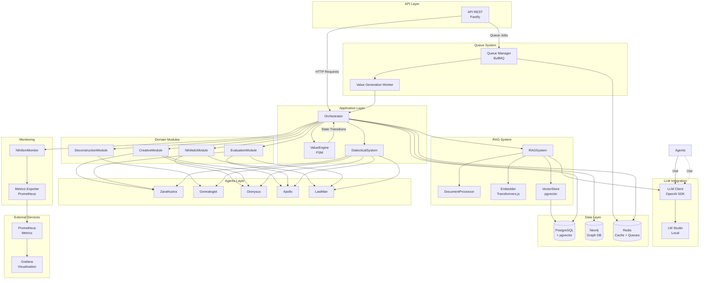
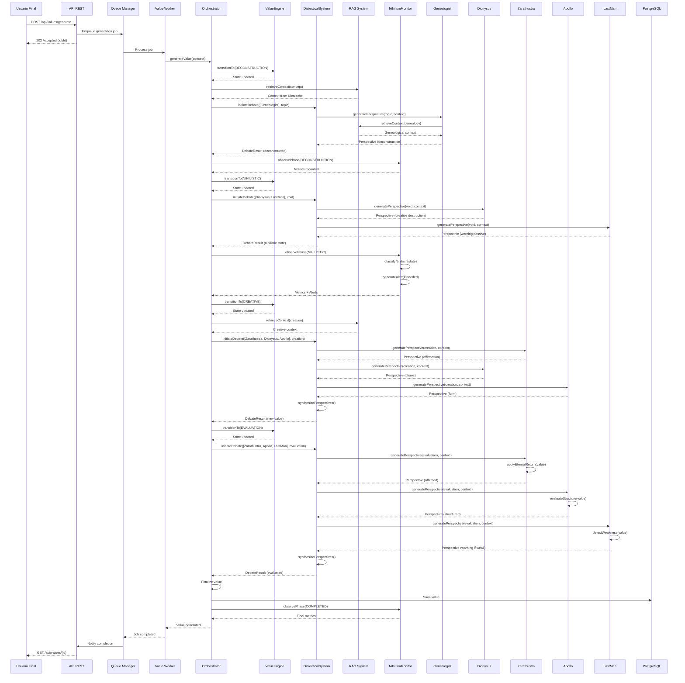
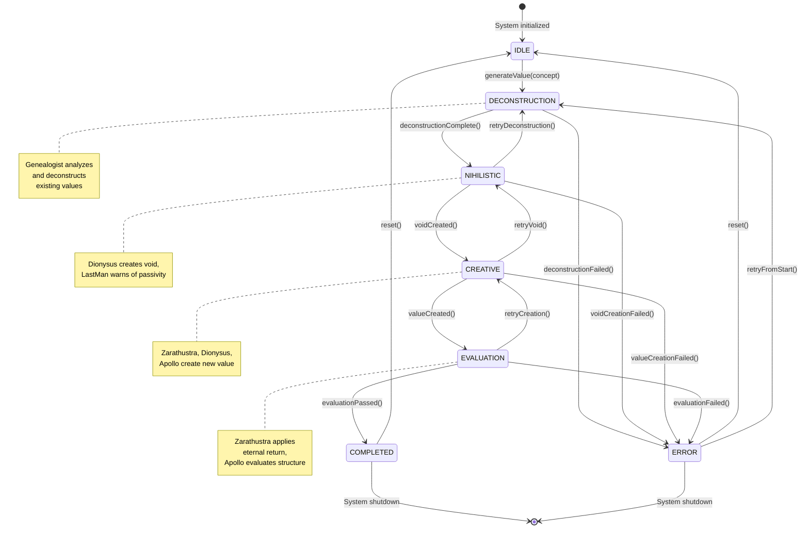
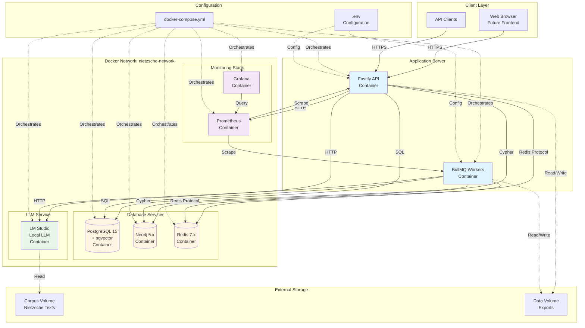

# Diagramas UML del Sistema

**Última actualización:** 2026-01-11  
**Versión:** 1.0

> **Nota:** Este documento contiene los diagramas UML completos del Sistema de Generación de Valores Nietzscheano, incluyendo diagramas de clases, componentes, secuencia, estados y despliegue.

## Introducción

Los diagramas UML son esenciales para visualizar y comunicar la arquitectura del sistema antes de la implementación. Este documento incluye todos los diagramas UML necesarios para entender la estructura, relaciones, flujos y despliegue del sistema.

**Diagramas incluidos:**
1. Diagrama de Clases - Estructura de clases y relaciones
2. Diagrama de Componentes - Componentes principales e interfaces
3. Diagrama de Secuencia - Flujos de interacción
4. Diagrama de Estados - Máquina de estados finitos (FSM)
5. Diagrama de Despliegue - Arquitectura de despliegue

## 1. Diagrama de Clases

El diagrama de clases muestra la estructura estática del sistema, incluyendo clases principales, módulos, agentes, interfaces y sus relaciones.

```mermaid
classDiagram
    %% Core Classes
    class Orchestrator {
        -valueEngine: ValueEngine
        -dialecticalSystem: DialecticalSystem
        -ragSystem: RAGSystem
        -nihilismMonitor: NihilismMonitor
        +generateValue(concept: string): Promise~Result~Value, Error~~
        +coordinatePhase(phase: Phase): Promise~void~
        +handleError(error: Error): void
    }
    
    class ValueEngine {
        -currentState: ValueState
        -stateHistory: ValueState[]
        +transitionTo(state: ValueState): Result~void, Error~
        +validateTransition(from: ValueState, to: ValueState): boolean
        +getCurrentState(): ValueState
        +reset(): void
    }
    
    class DialecticalSystem {
        -agents: Map~AgentType, Agent~
        -debateHistory: Debate[]
        +initiateDebate(participants: AgentType[], topic: string): Promise~DebateResult~
        +synthesizePerspectives(perspectives: Perspective[]): Synthesis
        +addAgent(agent: Agent): void
    }
    
    class NihilismMonitor {
        -metrics: NihilismMetrics
        -observers: Observer[]
        +observePhase(phase: Phase): void
        +classifyNihilism(state: NihilisticState): NihilismType
        +generateAlert(alert: Alert): void
        +getMetrics(): NihilismMetrics
    }
    
    %% Phase Modules
    class DeconstructionModule {
        -genealogist: Genealogist
        -ragSystem: RAGSystem
        +deconstruct(concept: MoralConcept): Promise~DeconstructionResult~
        +analyzeGenealogy(concept: MoralConcept): Genealogy
    }
    
    class NihilisticModule {
        -dionysus: Dionysus
        -lastMan: LastMan
        +createVoid(concept: MoralConcept): Promise~NihilisticState~
        +destroyValues(values: Value[]): void
    }
    
    class CreativeModule {
        -zarathustra: Zarathustra
        -dionysus: Dionysus
        -apollo: Apollo
        +createValue(concept: MoralConcept, void: NihilisticState): Promise~Value~
        +synthesizePerspectives(perspectives: Perspective[]): Value
    }
    
    class EvaluationModule {
        -zarathustra: Zarathustra
        -apollo: Apollo
        -lastMan: LastMan
        +evaluateValue(value: Value): Promise~EvaluationResult~
        +applyEternalReturn(value: Value): boolean
        +checkStructure(value: Value): StructureCheck
    }
    
    %% Agents
    class Agent {
        <<interface>>
        +generatePerspective(topic: string, context: Context): Promise~Perspective~
        +getName(): string
        +getPersonality(): Personality
    }
    
    class Zarathustra {
        +generatePerspective(topic: string, context: Context): Promise~Perspective~
        +affirmLife(value: Value): boolean
        +applyEternalReturn(value: Value): boolean
    }
    
    class Genealogist {
        +generatePerspective(topic: string, context: Context): Promise~Perspective~
        +deconstructGenealogy(concept: MoralConcept): Genealogy
        +revealOrigins(value: Value): Origin[]
    }
    
    class Dionysus {
        +generatePerspective(topic: string, context: Context): Promise~Perspective~
        +createFromVoid(void: NihilisticState): Value
        +destroyValues(values: Value[]): void
    }
    
    class Apollo {
        +generatePerspective(topic: string, context: Context): Promise~Perspective~
        +giveForm(value: Value): StructuredValue
        +evaluateStructure(value: Value): StructureCheck
    }
    
    class LastMan {
        +generatePerspective(topic: string, context: Context): Promise~Perspective~
        +detectWeakness(value: Value): boolean
        +warnPassiveNihilism(state: NihilisticState): Alert
    }
    
    %% RAG System
    class RAGSystem {
        -vectorStore: VectorStore
        -embedder: Embedder
        -documentProcessor: DocumentProcessor
        +retrieveContext(query: string, limit: number): Promise~Context[]
        +processCorpus(corpus: Document[]): Promise~void~
        +searchSemantic(query: string): Promise~Document[]
    }
    
    class DocumentProcessor {
        +chunkDocuments(documents: Document[]): Chunk[]
        +extractMetadata(document: Document): Metadata
    }
    
    class Embedder {
        +generateEmbedding(text: string): Promise~Vector~
        +generateBatchEmbeddings(texts: string[]): Promise~Vector[]~
    }
    
    class VectorStore {
        +storeEmbedding(embedding: Embedding): Promise~void~
        +searchSimilar(query: Vector, limit: number): Promise~Embedding[]
    }
    
    %% LLM Integration
    class LLMClient {
        <<interface>>
        +generate(prompt: Prompt): Promise~Response~
        +stream(prompt: Prompt): AsyncGenerator~Response~
    }
    
    class LMStudioClient {
        +generate(prompt: Prompt): Promise~Response~
        +stream(prompt: Prompt): AsyncGenerator~Response~
        -baseUrl: string
        -apiKey: string
    }
    
    %% Repositories
    class ValueRepository {
        +save(value: Value): Promise~void~
        +findById(id: string): Promise~Value | null~
        +findByCriteria(criteria: Criteria): Promise~Value[]~
    }
    
    class GenealogyRepository {
        +save(genealogy: Genealogy): Promise~void~
        +findByValueId(valueId: string): Promise~Genealogy | null~
    }
    
    %% Types
    class Value {
        +id: string
        +content: string
        +phase: Phase
        +createdAt: Date
        +genealogy: Genealogy
    }
    
    class MoralConcept {
        +name: string
        +description: string
        +origin: string
    }
    
    class Perspective {
        +agent: AgentType
        +content: string
        +tone: Tone
    }
    
    class DebateResult {
        +perspectives: Perspective[]
        +synthesis: Synthesis
        +conflicts: Conflict[]
    }
    
    %% Relationships
    Orchestrator --> ValueEngine : uses
    Orchestrator --> DialecticalSystem : coordinates
    Orchestrator --> RAGSystem : requests context
    Orchestrator --> NihilismMonitor : receives alerts
    Orchestrator --> DeconstructionModule : orchestrates
    Orchestrator --> NihilisticModule : orchestrates
    Orchestrator --> CreativeModule : orchestrates
    Orchestrator --> EvaluationModule : orchestrates
    
    ValueEngine --> ValueState : manages
    ValueEngine --> Phase : transitions
    
    DialecticalSystem --> Agent : coordinates
    DialecticalSystem --> Zarathustra : uses
    DialecticalSystem --> Genealogist : uses
    DialecticalSystem --> Dionysus : uses
    DialecticalSystem --> Apollo : uses
    DialecticalSystem --> LastMan : uses
    
    Agent <|.. Zarathustra : implements
    Agent <|.. Genealogist : implements
    Agent <|.. Dionysus : implements
    Agent <|.. Apollo : implements
    Agent <|.. LastMan : implements
    
    DeconstructionModule --> Genealogist : uses
    NihilisticModule --> Dionysus : uses
    NihilisticModule --> LastMan : uses
    CreativeModule --> Zarathustra : uses
    CreativeModule --> Dionysus : uses
    CreativeModule --> Apollo : uses
    EvaluationModule --> Zarathustra : uses
    EvaluationModule --> Apollo : uses
    EvaluationModule --> LastMan : uses
    
    RAGSystem --> VectorStore : uses
    RAGSystem --> Embedder : uses
    RAGSystem --> DocumentProcessor : uses
    RAGSystem --> LLMClient : uses
    
    LLMClient <|.. LMStudioClient : implements
    
    ValueRepository --> Value : manages
    GenealogyRepository --> Genealogy : manages
    
    NihilismMonitor --> ValueEngine : observes
    NihilismMonitor --> Phase : monitors
```

## 2. Diagrama de Componentes

El diagrama de componentes muestra los componentes principales del sistema, sus interfaces y dependencias externas.

## 3. Diagrama de Secuencia

El diagrama de secuencia muestra el flujo completo de generación de valores a través de las 4 fases, incluyendo interacciones entre componentes.

## 4. Diagrama de Estados (FSM)

El diagrama de estados muestra la máquina de estados finitos del ValueEngine, con todas las transiciones entre fases.

## 5. Diagrama de Despliegue

El diagrama de despliegue muestra la arquitectura de despliegue del sistema, incluyendo servicios Docker, contenedores y redes.

## Leyenda y Notas Explicativas

### Convenciones de Diagramas

**Diagrama de Clases:**
- `+` = Método público
- `-` = Atributo privado
- `<<interface>>` = Interfaz
- `-->` = Asociación/uso
- `<|..` = Implementación de interfaz
- `-->` con etiqueta = Relación específica

**Diagrama de Componentes:**
- Rectángulos = Componentes
- Líneas sólidas = Dependencias directas
- Líneas punteadas = Dependencias opcionales
- Subgrafos = Agrupaciones lógicas

**Diagrama de Secuencia:**
- Participantes verticales = Actores/Componentes
- Líneas horizontales = Mensajes/Interacciones
- Flechas sólidas = Llamadas síncronas
- Flechas punteadas = Respuestas
- Rectángulos = Activación

**Diagrama de Estados:**
- Estados = Fases del proceso
- Transiciones = Cambios de estado
- `[*]` = Estado inicial/final
- Notas = Descripciones de estados

**Diagrama de Despliegue:**
- Contenedores = Servicios Docker
- Volúmenes = Almacenamiento persistente
- Redes = Comunicación entre servicios
- Configuración = Archivos de configuración

### Notas Arquitectónicas

1. **Separación de Responsabilidades:**
   - Orchestrator coordina pero no contiene lógica de negocio
   - ValueEngine gestiona solo estados, no lógica de fases
   - Módulos encapsulan lógica específica de cada fase
   - Agentes son independientes y reutilizables

2. **Patrones de Diseño:**
   - **FSM (Finite State Machine):** ValueEngine
   - **Observer:** NihilismMonitor observa ValueEngine
   - **Strategy:** Diferentes agentes para diferentes perspectivas
   - **Repository:** Acceso a datos abstraído
   - **Factory:** Creación de agentes y módulos

3. **Dependencias Externas:**
   - PostgreSQL con pgvector para embeddings
   - Neo4j para relaciones genealógicas
   - Redis para cache y colas
   - LM Studio para LLM local
   - Prometheus/Grafana para monitoreo

4. **Escalabilidad:**
   - Workers pueden escalarse horizontalmente
   - Base de datos puede replicarse
   - Colas distribuyen carga
   - API stateless permite load balancing

## Referencias

- **Issue Linear:** [DNT-226: Crear diagramas UML del sistema](https://linear.app/clasificadoria/issue/DNT-226/docs-crear-diagramas-uml-del-sistema)
- **Epic Padre:** [DNT-224: Epic de Diseño Arquitectónico](https://linear.app/clasificadoria/issue/DNT-224/epic-diseno-arquitectonico-y-diagramas)
- **Casos de Uso:** [docs/use-cases.md](./use-cases.md)
- **Actores:** [docs/actors.md](./actors.md) (si existe)
- **Contexto del Proyecto:** [docs/project-context.md](./project-context.md)

## Notas de Mantenimiento

- Los diagramas deben actualizarse cuando cambie la arquitectura
- Los diagramas están en formato Mermaid para fácil versionado en Git
- Se pueden exportar a imágenes usando herramientas como Mermaid CLI
- Los diagramas reflejan el diseño actual y deben mantenerse sincronizados con la implementación

---

**Última actualización:** 2026-01-11  
**Mantenido por:** Equipo de desarrollo  
**Versión del documento:** 1.0
