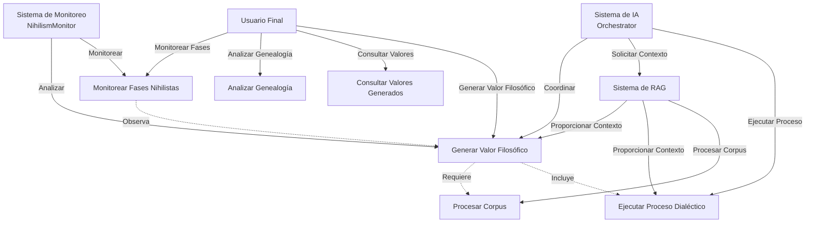
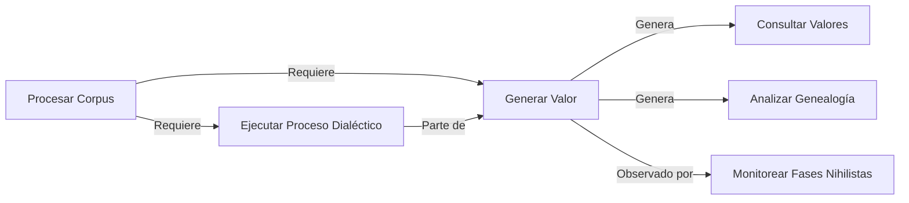

# Diagramas de Casos de Uso

**Última actualización:** 2026-01-11  
**Versión:** 1.0

> **Nota:** Este documento define los casos de uso principales del Sistema de Generación de Valores Nietzscheano, identificando actores, casos de uso, precondiciones, postcondiciones y flujos de interacción.

## Introducción

Los diagramas de casos de uso ayudan a entender las interacciones del sistema desde la perspectiva de los usuarios y actores externos, definiendo claramente qué puede hacer cada actor y cómo el sistema responde a sus solicitudes.

Este documento identifica y documenta los casos de uso principales del sistema, incluyendo:
- Actores principales (externos e internos)
- Casos de uso con descripciones detalladas
- Precondiciones y postcondiciones
- Flujos de interacción
- Diagramas en notación UML estándar

Para información detallada sobre los actores, consultar [docs/actors.md](./actors.md).

## Actores

### Actores Externos

**Usuario Final**
- **Tipo:** Actor Externo
- **Descripción:** Desarrollador, filósofo o investigador que utiliza el sistema
- **Responsabilidades:**
  - Generar nuevos valores filosóficos
  - Consultar valores generados
  - Analizar genealogía de valores
  - Monitorear fases nihilistas

### Actores Internos (Sistemas)

**Sistema de IA (Orchestrator)**
- **Tipo:** Actor Interno
- **Descripción:** Coordinador principal que ejecuta el proceso de generación
- **Responsabilidades:**
  - Ejecutar proceso de generación
  - Coordinar agentes dialécticos
  - Gestionar fases del proceso

**Sistema de Monitoreo (NihilismMonitor)**
- **Tipo:** Actor Interno
- **Descripción:** Observer que monitorea y clasifica fases nihilistas
- **Responsabilidades:**
  - Analizar métricas
  - Clasificar fases nihilistas
  - Detectar patrones
  - Generar alertas

**Sistema de RAG**
- **Tipo:** Actor Interno
- **Descripción:** Sistema de Retrieval-Augmented Generation
- **Responsabilidades:**
  - Procesar corpus de Nietzsche
  - Generar embeddings
  - Realizar búsqueda semántica
  - Proporcionar contexto filosófico

## Diagrama de Casos de Uso Principal

## Casos de Uso Principales

### 1. Generar Valor Filosófico

**Actor Principal:** Usuario Final  
**Actores Secundarios:** Sistema de IA (Orchestrator), Sistema de RAG, Sistema de Monitoreo

**Descripción:**
El usuario solicita la generación de un nuevo valor filosófico a partir de un concepto moral existente. El sistema ejecuta el proceso completo de 4 fases (Deconstrucción → Nihilismo → Creación → Evaluación) y retorna el valor generado.

**Precondiciones:**
- El sistema está configurado y operativo
- El corpus de Nietzsche está cargado y procesado
- Los agentes filosóficos están inicializados
- El usuario tiene acceso válido al sistema
- El concepto moral de entrada está definido

**Postcondiciones:**
- Se ha generado un nuevo valor filosófico
- El valor está almacenado en la base de datos
- Se ha registrado el proceso completo (4 fases)
- Se han generado métricas del proceso
- El usuario ha recibido el valor generado

**Flujo Principal:**
1. Usuario envía solicitud de generación con concepto moral de entrada
2. Sistema de IA (Orchestrator) recibe la solicitud
3. Orchestrator solicita contexto al Sistema de RAG
4. Sistema de RAG proporciona contexto relevante de Nietzsche
5. Orchestrator inicia Fase 1: Deconstrucción
   - Coordina debate con Genealogist
   - Deconstruye el concepto moral existente
6. Orchestrator transiciona a Fase 2: Nihilista
   - Coordina debate con Dionysus y LastMan
   - Crea vacío conceptual necesario
   - Sistema de Monitoreo observa y clasifica la fase
7. Orchestrator transiciona a Fase 3: Creativa
   - Coordina debate con Zarathustra, Dionysus y Apollo
   - Genera valores nuevos desde el vacío
8. Orchestrator transiciona a Fase 4: Evaluación
   - Zarathustra aplica criterio del eterno retorno
   - Apollo evalúa forma y estructura
   - LastMan detecta valores débiles
9. Orchestrator sintetiza el resultado final
10. Sistema almacena el valor generado
11. Sistema retorna el valor al usuario

**Flujos Alternativos:**
- **Error en proceso:** Si alguna fase falla, el sistema registra el error y notifica al usuario
- **Valor débil detectado:** Si LastMan detecta un valor débil, el sistema puede regenerar o alertar
- **Timeout:** Si el proceso excede el tiempo máximo, se cancela y notifica al usuario

**Casos Especiales:**
- Procesamiento en background mediante colas (BullMQ)
- El usuario puede consultar el estado del proceso mientras se ejecuta

### 2. Consultar Valores Generados

**Actor Principal:** Usuario Final

**Descripción:**
El usuario consulta valores previamente generados utilizando diferentes criterios de búsqueda (fecha, fase, agente, concepto de origen, etc.).

**Precondiciones:**
- El sistema tiene valores almacenados en la base de datos
- El usuario tiene acceso válido al sistema

**Postcondiciones:**
- Se retorna una lista de valores que cumplen los criterios
- El usuario puede acceder a detalles de cada valor

**Flujo Principal:**
1. Usuario especifica criterios de búsqueda
2. Sistema consulta la base de datos
3. Sistema filtra valores según criterios
4. Sistema retorna lista de valores encontrados
5. Usuario puede seleccionar un valor para ver detalles

**Variantes:**
- **Por fecha:** Consultar valores generados en un rango de fechas
- **Por fase:** Consultar valores que están en una fase específica
- **Por agente:** Consultar valores generados por un agente específico
- **Por concepto de origen:** Consultar valores generados a partir de un concepto moral específico
- **Por calidad:** Consultar valores filtrados por métricas de calidad

**Flujos Alternativos:**
- **Sin resultados:** Si no hay valores que cumplan los criterios, se retorna lista vacía
- **Criterios inválidos:** Si los criterios son inválidos, se retorna error de validación

### 3. Analizar Genealogía

**Actor Principal:** Usuario Final  
**Actor Secundario:** Sistema de RAG

**Descripción:**
El usuario selecciona un valor generado y solicita un análisis de su genealogía, mostrando el proceso de deconstrucción, las fases intermedias y las relaciones con el concepto original.

**Precondiciones:**
- El valor existe en el sistema
- El valor tiene información de genealogía almacenada
- El usuario tiene acceso válido al sistema

**Postcondiciones:**
- Se muestra la genealogía completa del valor
- Se visualizan las relaciones con el concepto original
- Se muestran las fases intermedias del proceso

**Flujo Principal:**
1. Usuario selecciona un valor generado
2. Usuario solicita análisis de genealogía
3. Sistema recupera información de genealogía del valor
4. Sistema consulta Sistema de RAG para contexto adicional
5. Sistema construye visualización de genealogía
6. Sistema muestra:
   - Concepto moral original
   - Proceso de deconstrucción (Fase 1)
   - Vacío conceptual (Fase 2)
   - Creación del nuevo valor (Fase 3)
   - Evaluación y validación (Fase 4)
   - Relaciones con otros valores
7. Usuario puede explorar detalles de cada fase

**Flujos Alternativos:**
- **Genealogía incompleta:** Si falta información, se muestra lo disponible y se indica qué falta
- **Valor sin genealogía:** Si el valor no tiene genealogía (caso antiguo), se indica que no está disponible

### 4. Monitorear Fases Nihilistas

**Actor Principal:** Usuario Final / Sistema de Monitoreo

**Descripción:**
El usuario o el sistema de monitoreo analiza las fases nihilistas del proceso, clasificando tipos de nihilismo, detectando patrones y generando alertas cuando es necesario.

**Precondiciones:**
- El sistema tiene procesos de generación activos o completados
- El Sistema de Monitoreo está operativo
- El usuario tiene permisos de monitoreo (si aplica)

**Postcondiciones:**
- Se han analizado las fases nihilistas
- Se ha clasificado el tipo de nihilismo (activo, pasivo, reactivo)
- Se han generado métricas y alertas si es necesario
- El usuario tiene visibilidad del estado nihilista

**Flujo Principal:**
1. Sistema de Monitoreo observa procesos de generación
2. Sistema detecta entrada en fase nihilista
3. Sistema analiza el estado de la fase:
   - Intensidad del vacío conceptual
   - Duración de la fase
   - Participación de agentes (Dionysus, LastMan)
4. Sistema clasifica el tipo de nihilismo:
   - Nihilismo activo: Destrucción creativa, fuerza vital
   - Nihilismo pasivo: Resignación, debilidad (advertencia)
   - Nihilismo reactivo: Rechazo sin creación
5. Sistema genera métricas y alertas si detecta problemas
6. Sistema almacena análisis en base de datos
7. Usuario puede consultar análisis y métricas

**Flujos Alternativos:**
- **Alerta de nihilismo pasivo:** Si se detecta nihilismo pasivo, se genera alerta y se notifica
- **Fase nihilista prolongada:** Si la fase se prolonga demasiado, se genera alerta
- **Valores débiles detectados:** Si LastMan detecta valores débiles, se genera alerta

**Casos Especiales:**
- Monitoreo en tiempo real durante procesos activos
- Análisis histórico de fases nihilistas pasadas
- Exportación de métricas a Prometheus

### 5. Ejecutar Proceso Dialéctico

**Actor Principal:** Sistema de IA (Orchestrator)  
**Actores Secundarios:** Agentes Filosóficos, Sistema de RAG

**Descripción:**
El sistema coordina un debate dialéctico entre los agentes filosóficos para generar perspectivas múltiples y sintetizar un resultado coherente. Este caso de uso es interno y se ejecuta como parte del proceso de generación de valores.

**Precondiciones:**
- Los agentes filosóficos están inicializados
- El Sistema de RAG tiene contexto disponible
- El Orchestrator ha determinado qué agentes deben participar
- Se ha definido el tema o pregunta del debate

**Postcondiciones:**
- Se ha ejecutado el debate dialéctico
- Se ha sintetizado una perspectiva coherente
- Se ha registrado el proceso del debate
- El resultado está disponible para el Orchestrator

**Flujo Principal:**
1. Orchestrator determina qué agentes deben participar según la fase
2. Orchestrator solicita contexto relevante al Sistema de RAG
3. Sistema de RAG proporciona citas y contexto de Nietzsche
4. Orchestrator inicia debate dialéctico:
   - Cada agente presenta su perspectiva
   - Los agentes responden y debaten entre sí
   - Se identifican contradicciones y síntesis
5. Orchestrator sintetiza las perspectivas en un resultado coherente
6. Orchestrator registra el proceso del debate
7. Orchestrator retorna el resultado sintetizado

**Variantes por Fase:**
- **Fase de Deconstrucción:** Genealogist lidera, otros agentes cuestionan
- **Fase Nihilista:** Dionysus y LastMan en diálogo, Zarathustra como contrapunto
- **Fase Creativa:** Zarathustra, Dionysus y Apollo en diálogo creativo
- **Fase de Evaluación:** Zarathustra y Apollo evalúan, LastMan advierte

**Flujos Alternativos:**
- **Debate sin síntesis:** Si no se puede sintetizar, se reintenta o se notifica error
- **Agente no disponible:** Si un agente no está disponible, se continúa con los disponibles

### 6. Procesar Corpus

**Actor Principal:** Sistema de RAG

**Descripción:**
El sistema procesa el corpus de textos de Nietzsche, generando chunks, creando embeddings y almacenándolos en la base de datos vectorial para su uso posterior en búsquedas semánticas.

**Precondiciones:**
- Los textos de Nietzsche están disponibles
- La base de datos vectorial (PostgreSQL con pgvector) está configurada
- El sistema de embeddings (Transformers.js) está inicializado

**Postcondiciones:**
- El corpus está procesado y dividido en chunks
- Los embeddings están generados y almacenados
- El corpus está indexado y listo para búsquedas semánticas
- Se ha registrado el proceso de procesamiento

**Flujo Principal:**
1. Sistema carga textos de Nietzsche desde archivos
2. Sistema divide textos en chunks manejables:
   - Aplica estrategia de chunking (por párrafos, por tamaño, etc.)
   - Preserva contexto y metadatos
3. Sistema genera embeddings para cada chunk:
   - Usa Transformers.js para generar embeddings
   - Aplica modelo de embeddings apropiado
4. Sistema almacena embeddings en base de datos vectorial:
   - Almacena en PostgreSQL con pgvector
   - Indexa para búsqueda eficiente
5. Sistema registra metadatos:
   - Fuente del texto
   - Fecha de procesamiento
   - Estadísticas del corpus
6. Sistema valida que el procesamiento fue exitoso

**Flujos Alternativos:**
- **Error en procesamiento:** Si hay error, se registra y se puede reintentar
- **Corpus parcial:** Si solo se procesa parte del corpus, se registra y se puede continuar después
- **Actualización incremental:** Si se añaden nuevos textos, se procesan incrementalmente

**Casos Especiales:**
- Procesamiento inicial del corpus (una vez)
- Actualización incremental cuando se añaden textos
- Re-procesamiento si cambia el modelo de embeddings

## Relaciones entre Actores y Casos de Uso

### Matriz de Relaciones

| Actor | Generar Valor | Consultar Valores | Analizar Genealogía | Monitorear Fases | Ejecutar Dialéctico | Procesar Corpus |
|-------|---------------|-------------------|---------------------|------------------|---------------------|-----------------|
| Usuario Final | ✓ Principal | ✓ Principal | ✓ Principal | ✓ Principal | - | - |
| Sistema de IA | ✓ Secundario | - | - | - | ✓ Principal | - |
| Sistema de Monitoreo | ✓ Secundario | - | - | ✓ Principal | - | - |
| Sistema de RAG | ✓ Secundario | - | ✓ Secundario | - | ✓ Secundario | ✓ Principal |

### Dependencias entre Casos de Uso

## Referencias

- **Issue Linear:** [DNT-227: Definir diagramas de casos de uso](https://linear.app/clasificadoria/issue/DNT-227/docs-definir-diagramas-de-casos-de-uso)
- **Epic Padre:** [DNT-224: Epic de Diseño Arquitectónico](https://linear.app/clasificadoria/issue/DNT-224/epic-diseno-arquitectonico-y-diagramas)
- **Actores:** [docs/actors.md](./actors.md) - Documentación completa de actores
- **Contexto del Proyecto:** [docs/project-context.md](./project-context.md)
- **Arquitectura:** [docs/architecture.md](./architecture.md) (pendiente de creación)

## Notas

- Los casos de uso están diseñados para ser extensibles y permitir futuras funcionalidades
- El sistema está diseñado para procesar múltiples solicitudes concurrentes
- Los casos de uso internos (Ejecutar Proceso Dialéctico, Procesar Corpus) son transparentes para el usuario final
- Los diagramas usan notación UML estándar para casos de uso
- Las precondiciones y postcondiciones son críticas para garantizar la integridad del sistema

---

**Última actualización:** 2026-01-11  
**Mantenido por:** Equipo de desarrollo  
**Versión del documento:** 1.0
